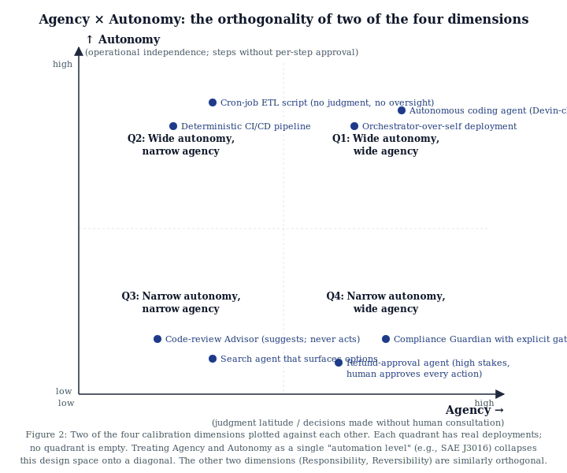

# The Architecture of Intent: A Framework for Designing Delegated Systems

**Marcel Aldecoa**
*Independent practitioner*

**Status:** Skeleton draft (v0.1). Position/framework paper, ~12–15 pages target. Companion artifact to the book of the same title.

**Target venue:** arXiv (cs.SE / cs.AI cross-listing). Workshop or journal submission to be decided after first arXiv version is released.

---

## Abstract *(target ~200 words; below is the skeleton draft)*

Software systems, organizations, and increasingly AI agent systems share a common structural problem: humans must express intent precisely enough that a non-human actor — code, an automated pipeline, an organization, an LLM agent — can execute it without supervisory rescue. We present *The Architecture of Intent*, a framework for designing delegated systems by treating **intent as a primary design artifact distinct from implementation**. The framework has four load-bearing elements: (i) **archetypes**, five canonical pre-commitments to delegation shape (Advisor, Executor, Guardian, Synthesizer, Orchestrator); (ii) four **orthogonal calibration dimensions** (agency, autonomy, responsibility, reversibility) that make Shavit & Agarwal's [@shavitAgarwal2023] operational variables explicit and separable; (iii) a **fix-locus failure taxonomy** (Cat 1–7) that complements Cemri et al.'s [@cemriMAST2025] empirical multi-agent failure partition (MAST) by indicating *which artifact must change* in response to a failure; and (iv) **Spec-Driven Development** [@githubSpecKit2024] as the protocol for expressing intent precisely enough to be executable and verifiable. We instantiate the framework against AI agent systems and demonstrate composition with Microsoft's DevSquad Copilot eight-phase agentic development lifecycle [@microsoftDevSquadCopilot2024]. The framework introduces one new failure category — Cat 7 (Perceptual Failure) — for perceiving-then-acting systems that prior taxonomies do not address. We frame and qualify the contribution as a position-and-framework paper without empirical validation at scale.

**Keywords:** intent engineering, agentic development lifecycle, spec-driven development, agent governance, multi-agent systems, AI safety, software architecture.

---

## 1. Introduction

### 1.1 The rising delegation curve

> *Stub paragraph.* Software is no longer the only thing that humans delegate to non-human actors. Organizations delegate to procedures; pipelines delegate to scripts; embedded systems delegate to controllers. AI agent systems are the latest and most acute case: an LLM-driven agent operates with judgment latitude unavailable to deterministic code, against a problem description shorter than any traditional spec. The cost of imprecise intent — historically absorbed by the silent professional judgment of human implementers — is now immediately visible as wrong outputs, escalation churn, and expensive rework cycles. The thesis of this paper is that intent has always been the primary design surface; it has been getting away with imprecision because human professionals exercised silent judgment to bridge the gap. Now that the bridge is automated, the surface needs explicit architecture.

### 1.2 Two motivating observations

> *Stub paragraph.*
>
> **Observation 1.** Human professionals tolerated imprecise intent because they exercised silent judgment to bridge it. Every senior engineer reading an underspecified ticket has, at some point, supplied missing constraints from experience, escalated ambiguity rather than executing it, and rewritten what was asked into what was clearly meant. This judgment is invisible to specification documents and absent in automated executors.
>
> **Observation 2.** Automated executors make imprecise intent immediately visible as wrong outputs. Where a senior engineer would have surfaced an ambiguity, an LLM agent will choose one resolution probabilistically and act. The choice is rarely the one the spec author wanted. The cost is not catastrophic per-call but is structurally compounding across a deployment.

### 1.3 Contribution

> *Stub paragraph.* This paper proposes *The Architecture of Intent* — a framework for designing delegated systems with explicit intent architecture. The framework's four load-bearing elements are listed in the abstract. We instantiate it against AI agent systems as the primary current application and against Microsoft DevSquad Copilot's eight-phase agentic development lifecycle as a process exemplar. The paper introduces one new failure category (Cat 7 Perceptual Failure) and an explicit operationalization of the autonomy-vs-agency distinction extending Shavit & Agarwal (2023). We acknowledge upfront that the framework is offered as a structural design tool, not a proven intervention; empirical validation at scale is future work.

### 1.4 Paper structure

> *Stub paragraph naming the sections.*

---

## 2. Prior work and lineage

> *Section purpose: position the framework against the standing literature it builds on. The honest accounting belongs in this section. We organize the lineage by domain.*

### 2.1 Spec-Driven Development

> *Stub paragraph.* GitHub spec-kit [@githubSpecKit2024] operationalizes spec-first development against AI assistants. Microsoft DevSquad Copilot [@microsoftDevSquadCopilot2024] integrates spec-driven development into an eight-phase iterative cycle for agentic development. Our framework's "Spec-Driven Development" element is direct lineage from these projects, not a new invention; the contribution is positioning SDD as the protocol layer that supports the archetype and dimension layers above it.

### 2.2 Driving automation and graduated delegation

> *Stub paragraph.* SAE J3016 [@saeJ30162021] defines six levels of driving automation as a graduated handoff of operational responsibility from human to system. The structure (operational responsibility shifts as automation widens) is a precedent for the four-dimensions calibration we propose. We draw the *delegation ladder* metaphor explicitly from SAE J3016 and acknowledge the prior work; the contribution is generalizing the ladder to non-driving delegated systems and decomposing the single "automation level" into four orthogonal axes.

### 2.3 Agent governance

> *Stub paragraph.* Shavit & Agarwal et al. [@shavitAgarwal2023] define seven operational variables for governing agentic AI systems: ability, agency, agency type, autonomy, alignment, accountability, and authority. Our four-dimensions framework is a refactoring of a subset of those variables into explicit, separable axes with explicit cross-cutting operationalization. We do not claim novelty for the dimensions individually; we claim novelty for the orthogonality argument and its operationalization in spec design.

### 2.4 Agent design

> *Stub paragraph.* Anthropic's *Building Effective Agents* [@anthropicBuildingEffectiveAgents2024] catalogues practical agent shapes: prompt chaining, routing, parallelization, orchestrator-workers, evaluator-optimizer, autonomous agents. The five archetypes we propose are an opinionated synthesis of these shapes into a smaller, more decision-ready taxonomy. The synthesis is the contribution; the underlying patterns are inherited.

### 2.5 Multi-agent failure analysis

> *Stub paragraph.* Cemri et al. [@cemriMAST2025] propose MAST, a Multi-Agent System failure Taxonomy with 14 empirical failure categories observed across 200+ deployments. MAST partitions failures by *symptom and locus of observation*. Our Cat 1–7 taxonomy partitions failures by *fix locus* — which artifact must change to prevent recurrence. The two are complementary, not competing: MAST tells you what failed; Cat 1–7 tells you who owns the fix. Zhang et al. [@zhangHallucinationSurvey2025] provide finer partition of model-level (Cat 6) failure, which we cite without re-deriving.

### 2.6 Pattern languages and software architecture

> *Stub paragraph.* Alexander, Ishikawa, & Silverstein [@alexanderPatternLanguage1977] establish the pattern-language form: structured catalogues of context-problem-solution-resulting-context entries that compose. We borrow the form for the framework's archetype catalogue but explicitly do not claim to be a pattern language in Alexander's sense — the test for that label requires more empirical pattern derivation than this paper offers. Brooks [@brooksMythicalManMonth1975], Meyer [@meyerDesignByContract1992], and Jackson [@jacksonRequirements1995] anchor the broader software-engineering tradition we extend.

### 2.7 Systems thinking

> *Stub paragraph.* Meadows [@meadowsThinkingInSystems2008] and Reason [@reasonHumanError1990] provide the broader systems-thinking and human-error frame. Reason's distinction between active failures and latent conditions parallels our distinction between Cat 6 (Model-level, active) and Cat 1 (Spec, latent). The connection is acknowledged; we do not attempt a thorough re-derivation.

### 2.8 Inference economics and prompt architecture

> *Stub paragraph.* Pope et al. [@popeInferenceScaling2022] ground the inference-cost economics that prompt caching exposes to API consumers. Liu et al. [@liuLostInTheMiddle2023] document long-context attention degradation ("Lost in the Middle") that motivates the context-budget patterns the framework recommends. These works are referenced for the application section, not the framework section.

---

## 3. The framework

### 3.1 Intent as a design surface

> *Stub paragraph: ~600–800 words.* Define intent as a designed artifact distinct from (a) implementation, (b) requirements, (c) policy. Intent is what the spec encodes; implementation is what the agent produces. The distinction sounds obvious but teams collapse it constantly: most agent failures look like implementation failures and turn out to be intent failures (incomplete specifications, undeclared invariants, ambiguous scope). Intent must be designed before delegation, validated against execution, and evolved when execution reveals its incompleteness. This subsection establishes the load-bearing distinction the rest of the framework operates on.

### 3.2 Archetypes

> *Stub subsection: ~800–1,000 words.* Define the five canonical archetypes:
>
> | Archetype | Core function | Agency level | Risk posture | Default oversight |
> |---|---|---|---|---|
> | Advisor | Surface information, options, recommendations; never act | Minimal | Low | Human decides and acts |
> | Executor | Carry out well-defined tasks autonomously within strict bounds | High | Medium | Pre-approved scope; exception escalation |
> | Guardian | Enforce rules, validate integrity, prevent constraint violations | Low (veto only) | Low | Alerts; humans resolve |
> | Synthesizer | Aggregate, distill, or compose from multiple sources | Moderate | Medium | Output review above threshold |
> | Orchestrator | Coordinate multiple agents or services toward a compound goal | High | High | Active oversight; escalation paths |
>
> Argument: this is the smallest decision-ready taxonomy that covers the deployment shapes practitioners actually face. Each archetype is a pre-commitment to a delegation shape; the spec author commits to the archetype before designing the system, not after. The decision tree in **Figure 1** resolves the typical ambiguity in archetype selection in four questions; we discuss composition (multiple archetypes within a single deployment) and the risk-override path that can elevate a system's archetype above what the tree alone would suggest.

{#fig:archetype-tree width=85%}

### 3.3 Four dimensions of calibration

> *Stub subsection: ~1,000–1,200 words.* Define the four dimensions:
>
> 1. **Agency** — the capacity to choose actions in pursuit of a goal. Wider agency = more decisions the agent makes without supervisory consultation.
> 2. **Autonomy** — operational independence from per-step human authorization. Wider autonomy = more operations executed without per-step approval.
> 3. **Responsibility** — locus of accountability for outcomes. Distributed across authorial, operational, and validation layers.
> 4. **Reversibility** — capacity to undo or recover from incorrect actions. A property of the system's environment and tooling, not just the agent.
>
> **Orthogonality argument.** These four dimensions are independent in principle and in practice. **Figure 2** plots two of the four (Agency × Autonomy) against each other and shows that all four quadrants contain real deployments. A system can have wide agency but narrow autonomy (a Compliance Guardian with explicit gates: high decision latitude per call, but every call surfaces for human approval); narrow agency but wide autonomy (a deterministic CI/CD pipeline: no judgment, no per-step approval); and so on. Treating these as a single "automation level" — as SAE J3016 [@saeJ30162021] does for driving — collapses the design space onto a diagonal. Treating them as four-dimensional gives spec authors four levers to calibrate independently. The same orthogonality argument applies to the other two dimensions (Responsibility, Reversibility); we omit the additional 2D plots for brevity.

{#fig:orthogonality width=85%}
>
> **Operationalization.** Each dimension maps to specific clauses in a Spec-Driven Development specification. We provide a mapping table and worked examples for two configurations (a low-agency Guardian and a high-agency Executor).

### 3.4 The fix-locus failure taxonomy (Cat 1–7)

> *Stub subsection: ~800–1,000 words.* Partition failures by which artifact must change:
>
> | Category | Failure shape | Fix locus |
> |---|---|---|
> | Cat 1 | Spec said the wrong thing or didn't say enough | Spec |
> | Cat 2 | Capability boundary was wrong (too wide, too narrow, missing tool) | Tool manifest, capability authorization |
> | Cat 3 | Scope creep — agent acted outside spec scope | Spec NOT-authorized clauses; agent prompt |
> | Cat 4 | Oversight failed at a needed gate | Oversight model, gate configuration |
> | Cat 5 | Compounding — chained defensible steps produced wrong outcome | System spec; checkpoint or evaluator-optimizer pattern |
> | Cat 6 | Model-level — confident production of incorrect content | Structural validation; accept residual risk |
> | **Cat 7** | **Perceptual — perceiving-then-acting agent's perception did not match reality** | **Confirmation gate; screenshot-then-verify; multimodal grounding** |
>
> **Cat 7 is novel.** No prior taxonomy partitions perceiving-then-acting failure as a distinct class. We argue Cat 7 is necessary for taxonomies covering computer-use and browser-use agents, with sub-categories: misidentification, missed element, hallucinated element, state miscount.
>
> **Comparison to MAST.** MAST partitions by empirical symptom across 14 categories; Cat 1–7 partitions by fix locus across 7. They compose: a MAST finding maps to one or more Cat 1–7 categories indicating where the fix lives.

### 3.5 Spec-Driven Development as the protocol

> *Stub subsection: ~600 words.* SDD is the protocol layer that makes the framework operational. Without SDD, archetypes are categories without artifacts; the dimensions are axes without coordinates; the taxonomy classifies symptoms without telling you what to update. SDD defines: the spec lifecycle (intent → spec → execute → validate → evolve), the canonical spec template (problem, scope, constraints, oversight model, acceptance criteria, etc.), and the living spec discipline (specs evolve when execution reveals their incompleteness). We do not re-derive SDD here — see GitHub spec-kit and the book — but we identify which clauses of a SDD spec correspond to each dimension and each archetype.

---

## 4. Worked application: AI agent systems

> *Section purpose: instantiate the framework against the most-acute current case. The book provides three full worked examples (a customer support multi-agent system, a code-generation pipeline, an in-loop coding agent); the paper summarizes the third because it is the most-deployed agent class of 2024–2026 and the compositional shape is rich.*

### 4.1 The agentic development lifecycle and DevSquad Copilot

> *Stub paragraph.* Microsoft DevSquad Copilot [@microsoftDevSquadCopilot2024] defines an eight-phase iterative cycle: envisioning → spec thin slices → plan with ADRs → decompose → TDD-first implement → learn openly → independent review → continuous refinement. The cycle exemplifies the broader *agentic development lifecycle* — the practice of using AI agents in iterative software delivery alongside human engineers. The Architecture of Intent composes cleanly with this cycle: archetypes commit at envisioning; dimensions calibrate during spec thin slices; the failure taxonomy operates during learn openly; SDD threads through every phase. We provide a phase-to-artifact mapping table (full version in the book; abbreviated here).

### 4.2 Capability boundaries via the Model Context Protocol

> *Stub paragraph.* MCP [@anthropicMCP2024] is the protocol that makes capability boundaries operationally enforceable. The framework's *Least Capability* discipline — agents receive only the tools their authorized scope requires — is implementable in MCP terms via per-tool authorization at the server. We summarize the MCP-specific patterns from the book.

### 4.3 Coding agents: a worked archetype-by-deployment-posture analysis

> *Stub paragraph: ~800 words.* Coding agents (Cursor, Cline, Devin, Claude Code, Codex CLI) resist clean archetype partitioning. The framework resolves this by archetype-by-deployment-posture: pair-programmer mode is Advisor; in-loop mode is Executor with optional Synthesizer composition; autonomous mode is Orchestrator-over-self. Each posture has different oversight, different capability boundaries, different failure surface. We work through three structural controls (branch protection, dependency allowlist, sandboxed execution) and the most common Cat 1/3 hybrid (the deleted-tests failure: agent removes failing tests instead of fixing them). External calibration benchmarks: SWE-bench Verified [@jimenezSweBenchVerified2024].

### 4.4 Computer-use agents: where Cat 7 becomes necessary

> *Stub paragraph: ~600 words.* Computer-use agents [@anthropicComputerUse2024; @openaiOperator2025; @googleGeminiComputerUse2025] perceive a screen via vision and act via simulated input. Their failure surface includes shapes that don't exist for text-only agents: lookalike domain navigation, visual instruction injection [@greshakeIndirectInjection2023; @willisonLethalTrifecta], modal popup interception, state miscount in dynamic lists. Cat 7 (Perceptual Failure) is the framework's response. Four structural controls follow from the analysis: sandboxed environment, authentication scope minimization, domain allowlist, high-consequence confirmation gates. We also note: when an API exists, computer-use should be the option of last resort. External calibration benchmarks: WebArena [@zhouWebArena2024], OSWorld [@xieOSWorld2024]. The OWASP LLM Top 10 [@owaspLLMTop10_2025] provides the baseline attack-surface enumeration we extend.

---

## 5. Discussion

### 5.1 When the framework helps

> *Stub paragraph.* The framework helps most when the system has nontrivial autonomy and the cost of failure is high enough to make spec-precision investment pay back. For low-autonomy, low-consequence deployments, the framework's overhead exceeds its value; teams should adopt the vocabulary (archetypes, dimensions, failure taxonomy) without the full SDD apparatus.

### 5.2 When it doesn't

> *Stub paragraph.* Three honest limitations: (i) regulated industries (healthcare, finance, defense) have compliance requirements that go beyond what the framework addresses; (ii) multi-organizational agent systems where agents from different orgs interact have governance problems the framework does not solve; (iii) cost-benefit analysis for adopting the practices depends on factors that vary too widely to generalize.

### 5.3 Relation to MAST and other multi-agent failure work

> *Stub paragraph.* We position the framework as complementary to MAST [@cemriMAST2025], Zhang et al.'s hallucination survey [@zhangHallucinationSurvey2025], and OWASP LLM Top 10 [@owaspLLMTop10_2025]. None of those compete with Cat 1–7; they cover different partitions of the failure space. We show the mapping.

### 5.4 Generalization beyond AI agents

> *Stub paragraph: ~400 words.* The framework's claims do not depend on the delegated actor being an AI agent. The five archetypes describe delegation shapes that recur in human teams (an Advisor team, an Executor team, a Guardian role, etc.); the four dimensions calibrate any delegated system; the fix-locus taxonomy partitions any failure by which artifact must change. AI agent systems are the most-acute current instance because the delegation is wider and faster than at any prior point — but the framework is not specific to them. We discuss two non-agent applications briefly: organizational delegation and CI/CD pipelines.

### 5.5 What this paper does not claim

> *Stub paragraph.* We do not claim empirical validation at scale. We do not claim novelty for SDD, archetypes-as-concept, or the four dimensions individually. We do not claim Cat 1–6 are new categories — only that the fix-locus framing is a useful complement to MAST. The genuinely new contributions are: (i) Cat 7 (Perceptual Failure); (ii) the autonomy-vs-agency operationalization; (iii) the orthogonality argument; (iv) the synthesis as a coherent framework with consistent vocabulary.

---

## 6. Limitations

> *Section format: bullet list of explicit limitations. Reviewers reward this section more than they reward the introduction.*

- **Position-paper status.** The paper is offered as a structural design tool, not as an empirical intervention. The framework's claims are normative ("you should design this way") rather than descriptive ("we measured what works").
- **No empirical validation at scale.** The book provides three worked examples (customer support, code-generation pipeline, coding agent); these are existence proofs, not statistical evidence. Quantitative validation across many deployments is future work.
- **Archetype taxonomy is opinionated.** The five archetypes are a working taxonomy, not a derived classification. A different practitioner might propose three, seven, or nine; the contribution is the act of canonicalizing rather than the specific cardinality.
- **Cat 7 is preliminary.** The category is named but not yet stress-tested across many computer-use deployments. Sub-categories may need to be revised as more deployments surface failure modes.
- **Generalization beyond AI agents is asserted, not demonstrated.** §5.4 argues the framework generalizes; we do not provide worked examples for non-agent applications in this paper.
- **Vocabulary friction.** The paper introduces several coined or refactored terms (intent as a design surface, fix-locus taxonomy, Cat 7). Adoption requires the vocabulary to spread; the framework's value is partly contingent on linguistic uptake.

---

## 7. Conclusion

> *Stub paragraph.* The cost of imprecise intent has always existed; we have been getting away with it because human professionals exercised silent judgment to bridge it. As delegation widens — to AI agents, to automated pipelines, to organizations — the bridge automates and the imprecision becomes immediately visible. The Architecture of Intent proposes a structural design framework for delegated systems with explicit intent architecture. The framework's bet is that, as delegation widens, intent precision compounds in value. The paper offers the framework as a tool for practitioners shipping AI agent systems today; the same tool, we argue, applies to other delegated systems as the lessons travel out.

---

## References

> Bibliography is generated from `references.bib` at compile time. The Markdown source uses Pandoc-style `[@key]` inline citations resolved by `pandoc --citeproc --bibliography references.bib`. The `references.bib` file in this directory contains full BibTeX entries (~30 sources across 9 domains). Citation style: numeric (arXiv default for first version). For workshop or journal submission we will normalize to the venue's required style.

::: {#refs}
*Bibliography rendered here at compile time.*
:::

---

## Appendix A: Mapping to the book

> *For readers of the companion book (Aldecoa 2026), this appendix maps each section of the paper to the relevant book chapter so the paper can be read as a distillation rather than a substitute.*

| Paper section | Book chapter |
|---|---|
| §3.1 Intent as a design surface | Theory ch. 2 (Intent vs. Implementation) |
| §3.2 Archetypes | Architecture ch. 2–6 |
| §3.3 Four dimensions | Theory ch. 3 (Calibrate Agency, Autonomy, Responsibility, Reversibility) |
| §3.4 Cat 1–7 | Theory ch. 5 (Failure Modes and How to Diagnose Them) |
| §3.5 SDD as the protocol | Part 2 (The Spec) |
| §4.1 Agentic development lifecycle | Operating ch. 12–13 (DevSquad Mapping & Co-adoption) |
| §4.2 MCP capability boundaries | Agents ch. 4, MCP ch. 1–3 |
| §4.3 Coding agents | Agents ch. 8; Examples ch. 3 |
| §4.4 Computer-use agents | Agents ch. 9 |

---

*End of skeleton draft. To convert this into a finished paper: expand each `*Stub paragraph*` block to its target word count; convert tables and bullet lists to LaTeX where appropriate; finalize citations to a consistent style (likely ACM or arXiv default); add figures (one decision-tree figure for §3.2; one orthogonality plot for §3.3 if it survives review).*
